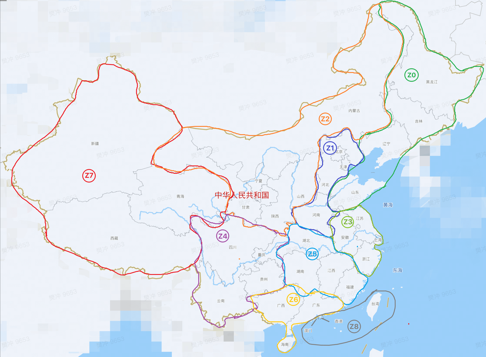

# @yuo/ip2region

> [区域编号对应文档](https://philuo-int.feishu.cn/wiki/wikcnJCm066Jh4nxYRfdi2joPYb)

## 特点简介

- 📚 仅ipv4, 精确匹配国内省市区, 作者不提供ip数据源, 仅作为技术学习参考使用。
- ⚡️ `50w~80w` *qps*, $10^{-6}$ 秒级查询
- 🍉 3.9MB, 短小精悍
- ⛑ 内存数据库, 安全高并发

## 数据源测试参考

[每隔一段时间, 会有更新](http://ips.chacuo.net/view/s_HI)
[城市IP段落](https://ip.bczs.net/city)

```
// ip.txt
223.255.253.0|223.255.253.255|贵州|贵阳|电信

// ip.city.txt, ./data/citycode.ts 映射
223.255.253.0|223.255.253.255|25|0|电信
```

## 使用方法

```bash
npm i @yuo/ip2region
```

```ts
import IpReader from '@yuo/ip2region';

// { pid: 1, cid: 0, zone: 'z1', province: '北京', city: '北京', ips: '阿里云' }
IpReader('39.107.84.26');
```

## 服务区域划分

`IpReader(ip).zone 描述的区域`


